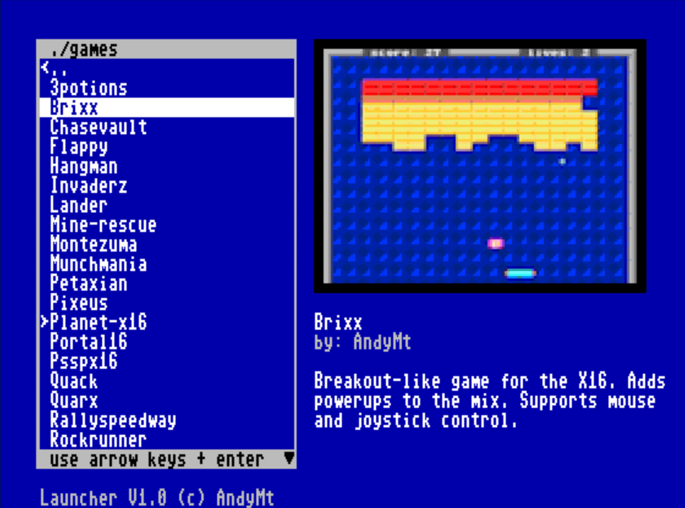
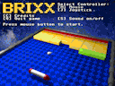
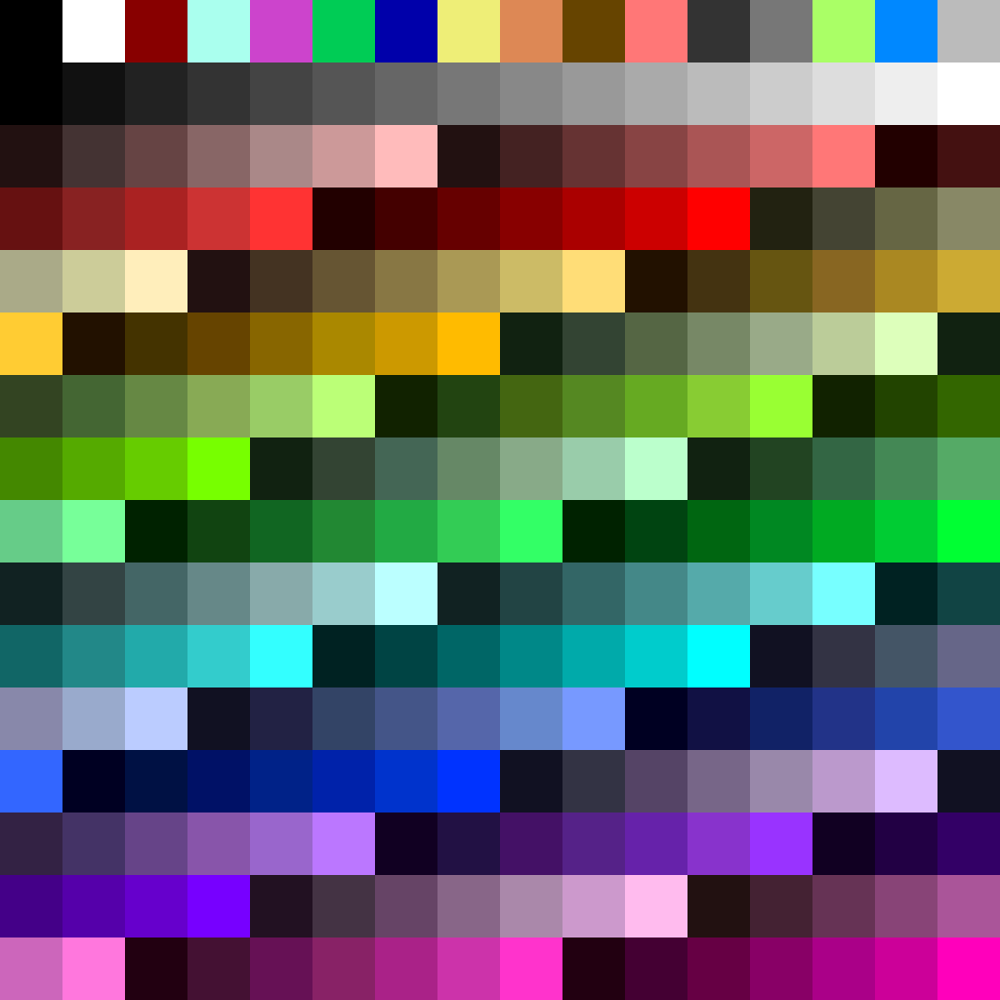

# X16-Launcher

*Launcher for the Commander X16* 

This launcher allows to browse the directory structure of the SD card for X16 programs. 
Each program is presented by a thumbnail with a short text description. This is done by providing thumbnail images in ABM format and a INF file for each PRG file.
The match is performed by the name portion of the PRG filename.

If a thumbnail is missing, then a default icon is shown.
If no INF file is found, then just the program name is shown.

## Using Launcher

Launcher can be operated by keyboard or gamepad/joystick.
Shows an introduction message at the first start.

**Navigation by keyboard:**
- up/down:    scroll through directory list 
- left/right: cycle through thumbnails (if multiple) 
- enter:      select directory or start program 
- dot:        to parent directory 
- any letter: jump directly in the list 
- f1:         show introduction message
- esc:        exit launcher

**Navigation by joystick/controller:**
- up/down:    scroll through directory list 
- left:       to parent directory 
- any button: select directory or start program 

## Configuration and Operating modes:

Launcher can operate in 2 different modes: 

### Local (default): 
looks for the INF and ABM file inside the same directory of the PRG file. This means every program needs to reside in it's own directory with the same name as the PRG (without .prg extension).

### Global: 
looks for all INF and ABM files inside configurable directories. Filenames need to be the same as the PRG name.

### LAUNCHER.INI file:
>\# Configuration &ensp; *some comment line* 
[Config] 
localmode=0 &ensp; *operating mode* 
startDir=/ &ensp; *where to start scanning for PRG files* 
thumbDir=/LAUNCHER/.THUMB &ensp; *where the ABM files are located* 
metaDir=/LAUNCHER/.META &ensp; *where the INF files are located* 
launcherDir=/LAUNCHER &ensp; *where the launcher's temporary files are located* 

## Metainformation files:

text based file format as follows: 
1st two lines are parameters, the rest is description.

>**Title:** *title to show. max 32 chars* 
>**Author:** *optional - author of program orother copyright info.* 
>*description. max 5x32 chars. Automatic word wrap.*

## How to create thumbnails

the ABM format is a binary image with 128x96 pixel of size, 8bpp.  **Example:**  

The palette used is the default X16 ROM palette: 
 
Make sure the source files use exactly this palette and **don't** change any color indices. Store files as PNG files 8bpp.
Aseprite is a good tool to manage PNG files and palettes accurately, as well as scaling.

## Building the provided thumbnails in this repository

The source code contains the [build.cmd](assets/build.cmd) script to build all thumbnails in the [assets directory](assets/Thumbnails128x96) using the tool [aloevera](https://github.com/yeastplume/aloevera). 
[LAUNCHER](assets/LAUNCHER) directory will contain ABM thumbnail files.

## Building Launcher
- cc65 is installed and included in path
- use "make" to build the LAUNCHER.PRG

## Technical background
*Launcher* uses 80x25 columns text mode. Actually it's 64x20 (512x192 pixels) to allow for overscan safe areas on CRTs. To show the thumbnails it's using sprites in a 8x3 8bpp configuration. Because of the doubled horizontal resolution in this mode each sprite has to stretch it's part of the thumbnail by a factor of 2 *(pity VERA doesn't support sprite stretch modes natively, the C64 did...)*. This increases loading time, so this part of the launcher is optimized in assembler. 
To safe time the default X16 palette is used. Consequently all source material for thumbnails needs to be exactly 128x96 pixels of size. The color indexes used need to be exactly the same as in the default palette. This reduces loading time.
